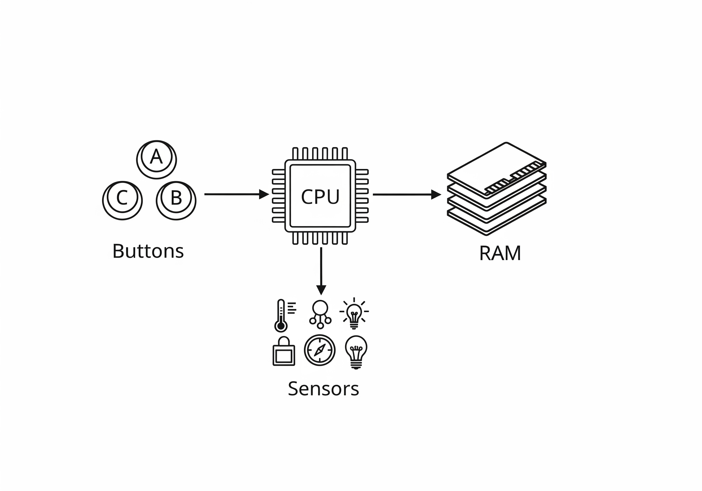

# Kort om computere

For at kunne skrive fornuftige computerprogrammer, er man nødt til at vide noget om, hvordan en computer fungerer. Dog er et et forholdsvis stort emne, hvor der er mange detaljer. Vi giver derfor et meget overordnet overblik.

## Opbygning af en micro:bit

Vi har set, at en micro:bit har nogle knapper og nogle sensorer. Hvilket ikke er hele historien. Alle computere har det der kaldes en CPU (central processing unit). Det er den chip, der sørger for at programmer bliver udført. En CPU er snotdum. Den udfører instruktioner en efter en uden at forholde sig til indholdet af instruktionerne. Den er heller ikke i stand til at huske (i hvert fald ikke særligt meget). Så derfor er der også noget hukommelse, kaldet RAM (random access memory), på en micro:bit, som anvendes til at opbevare programmer og de variable programmerne opretter.

Diagrammet oven for viser de fire overordnede bestand dele af en micro:bit.

1. CPU, som den enheden, der udfører programmet.
2. RAM, som er hukommelse, hvor program og programmet variable ligger.
3. Sensorer, som anvendes til at aflæse fx temperatur.
4. Knapper som vi anvender til at give vores program beskeder.

Der er også tre pile. De viser vejen for den første kommunikation mellem delene. Det skal forståes således, hvis fx der skal anvendes RAM/hukommelse, så skal CPU'en *først* henvende sig til hukommelsen, for at få gemt eller hentet noget fra hukommelsen. Det er aldrig hukommelsen der indleder kommunikation med CPU'en.

## Variable og hukommelse
En variabel et navn for et område af hukommelsen. Vi anvender variable, når vi ønsker at gemme en oplysning til senere brug. Så når vi "sætter" en variabel i vores kode. Så fortæller vi CPU'en: "Fortæl RAM/hukommelsen, at den skal opbevare følgende, som jeg kalder ...". Når vi bruger en variabel i vores kode i fx en forgrening (hvis-blok), så fortæller vi CPU'en: "hent den ting jeg har kaldt ... og sammenlign den med ...".

Det væsentlige er, at variablens navn henviser til hukommelsen, så det eneste vi skal vide, når vi skriver kode er navnet.

En detalje er variable kan have forskellige *typer*. Der er fire overordnede typer, der findes i alle programmeringssprog. 

- Boolske variable: Variable, der kun kan indholde værdierne sand og falsk.
- Heltalsvariable: Variable, der kun kan indholde hele tal fx 1,2, eller 3...
- Decimaltalsvariable: Variable, der kun kan indeholde kommatal fx 1,3434
- Tekstvariable: Variable, der kun indeholder tekst fx "Tallet pi er lig med 3,14"

## Sensorer

Ligesom med hukommelsen, skal CPU'en *først* spørge en sensor om værdier, før den får noget tilbage. Dermed er *ikke* sådan, at sensorerne sender noget til CPU'en uden først at være blevet spurgt. 

Det forklarer, hvorfor de blokke, der har med sensorers værdier at gøre, ofte optræder som variable. Det betyder også, at den normale arbejdsgang i et program er at aflæse en værdi fra en sensor, og placere den i en variabel. Derefter kan variablen, så undersøges med fx forgreninger.

Den sidste pil på diagrammet går fra diagrammet til CPU'en. Det vil sige, det omvendte af de to andre pile det kræver en forklaring, som bliver givet i næste afsnit.