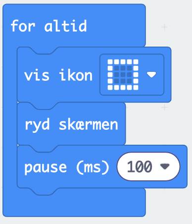
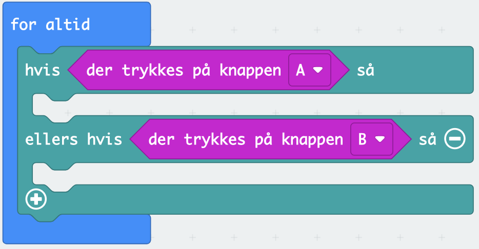
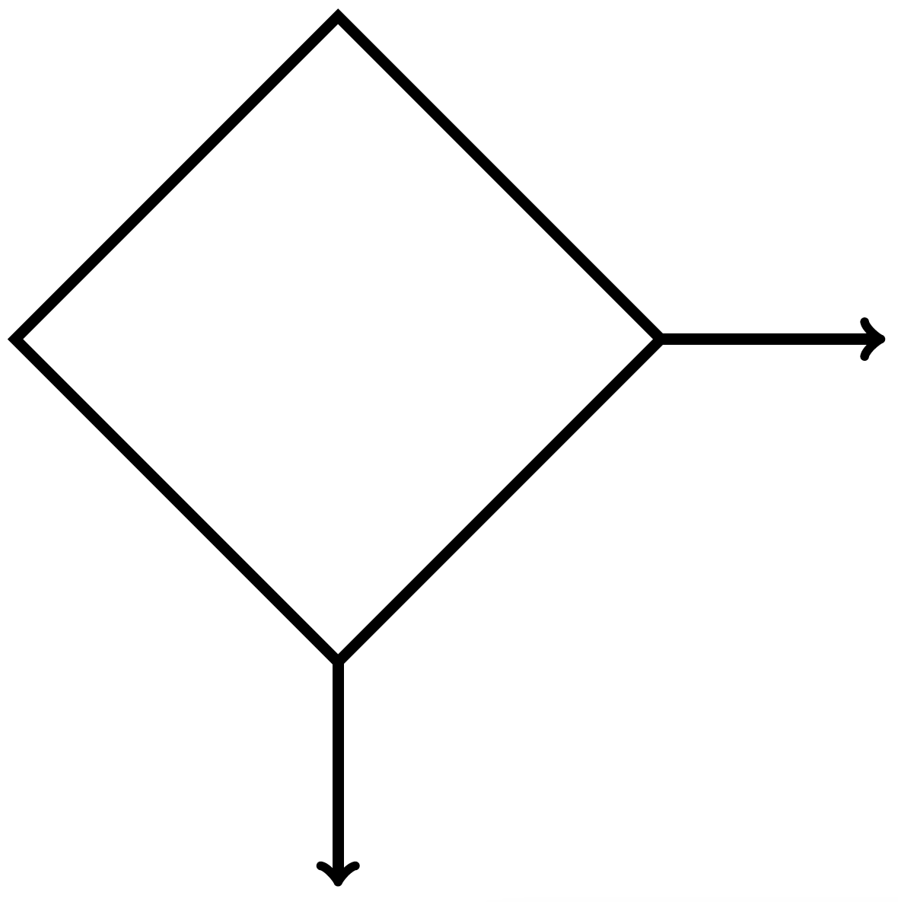
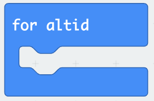
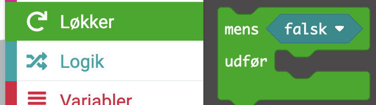
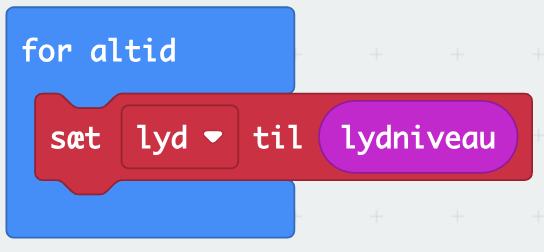

# Fagbegreber

Vi vil her forklare nogle fagbegreber i forbindelse med programmering.

## Sekvens

Ordet sekvens dækker over flere kodelinjer, hvor der sker handlinger. For eksempel

De tre linjer inden i for-altid-løkken er en sekvens.

## Forgrening

En forgrening er et sted i koden, hvor der skal træffes et valg. En forgrening har en eller flere betingelser, der skal have værdien sand eller falsk. Der er (som regel) to grene. En hvor betingelsen er opfyldt, og en hvor betingelsen ikke er opfyldt. Et eksempel er inde i for-altid-løkken:

Her er der to grene og gren nummer to bliver kun kørt hvis dens betingelse er sand, og den første betingelse til den første gren er falsk. 

Forgreninger anvendes til at skifte mellem tilstande. Og de har følgende symbol i et rutediagram

## Løkke
En løkke er en konstruktion, der får noget kode til at gentage sig selv. Der findes over ordnet to slags. Den første er en løkke, der bare kører til uendelig tid

Den anden er der den løkke, der afhænger af en betingelse.

Løkker er nemme at få øje på i rutediagrammer. Idet de laver en tja... en løkke.

## Variabel

En variabel er et navn for noget data, som ligger i hukommelsen. Variable kan have forskellige typer.

1. Boolske udsagn: Har værdierne sandt/falsk.
2. Heltal.
3. Decimaltal.
4. Tekst.

Før variable kan anvendes skal de have en værdi. Et eksempel hvor en variabel får en værdi er:

Variable kan fx anvendes i forgreninger.

## Eventhandler
Se [evenhandler](./knapperevent.md#eventhandler)