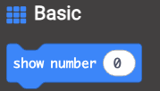
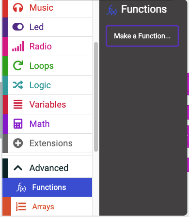
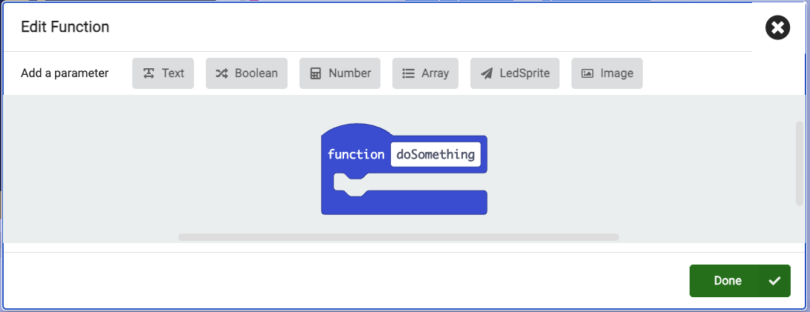
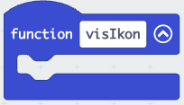
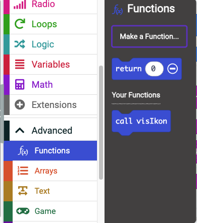

# Funktioner

Alle programmeringssprog har en konstruktion, der kaldes funktioner.

|Definition: Funktion|
:-|
|En funktion er noget kode, der har fået et navn. Navnet kan anvendes til at *kalde* funktionen fra et helt andet sted i koden.|

Denne definition lyder måske mærkelig, men man vil uværgelig komme anvende funktioner, når man skriver kode. For langt de fleste programmeringssprog har indbyggede funktioner. Et eksempel fra makecode kunne være:

Her beder vi om at, der vises et tal på micro:bittens dioder. Men der er faktisk sket en hel del andet som vi ikke kan se. Først skal alle dioder slukkes, så skal tallet oversættes til, at nogle bestemte dioder er tændte, så skal de dioder tændes. Så i virkeligheden sker der en hel masse andet omme bagved foregår et andet sted.

Funktioner bruges ofte til at genbruge kode, så når vi en gang har fundet ud af, hvordan vi viser tal på dioderne, så skal vi ikke gøre det igen.

## Funktioner vi selv skaber

Der nogle tilfælde, hvor det giver mening at selv skabe funktioner.

1. Når vi har nogle blokke som vi bruger flere steder. Og hvor vi hele tiden skal rette koden flere steder.
2. Når vores kode er meget uoverskuelig. Fx hvis vores "for altid" løkke er meget lang.

Vi kan oprette en funktion, ved at gå ned i avanceret og vælge funktioner.

Det bringer os videre til en menu, hvor der er nogle muligheder. Blandt andet, at navngive ens funktion. Som altid giver det mening, at vælge et meningsfuldt navn.

Når funktionen er oprettet kan den trækkes ud og fyldes med blokke.

Der er kan kun være én funktionsblok med et bestemt navn.

For at anvende en funktion skal den *kaldes*. Det gøres ved at trække en blok ud, der hvor funktionen skal kaldes fra.

Det kræver lidt tilvænning at anvende funktioner, men det er et kraftfuldt værktøj til at undgå gentagelser og genbruge kode.