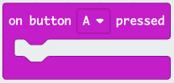

# Knapper og begivenheder

I det foregående [afsnit](./computere.md). Så vi på hvordan en micro:bit er opbygget med CPU, sensorer, og hukommelse. Men vi mangler at behandle knapper. Hvad sker der, når der trykkes på en knap? Der er to muligheder.

1. CPU'en "spørger" knappen om den er trykket ned. Denne mulighed er måske meget fin, hvis der én knap, men er et problem, hvis der er ca. 100 knapper, som et computer keyboard godt kan have (hvis vi regner shift/alt/ctrl-kombinationer som separate knapper).
2. Når knappen bliver trykket på, så fortæller knappen CPU'en, at den er blevet trykket. CPU'en kan så afbryde det den har gang i og gøre noget, hvis programmet har fortalt CPU'en hvad den skal gøre.

Det er løsning 2 computere anvender. 

## Eventhandler

Når der trykkes på en knap, så sender knappen en besked til CPU'en (eng: Interrupt). CPU'en ser så om programmet har "registeret" en noget kode, der skal udføres, hvis knappen er blevet trykket.

Denne kode kaldes en "eventhandler" og er kendetegnet ved, at det er kode, der kun gøres, når en begivenhed sker.

I makecode er der eventhandlers for tryk på knapper, modtagelse af radiosignaler og nogle få andre begivenheder. En eventhandler ser sådan ud som en blok:

Her vælges den begivenhed, der skal håndteres og inde i blokken kan der skrives den kode, der skal udføres. Bemærk, at der *ikke* er tale om en løkke.