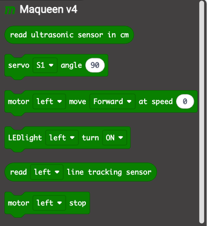
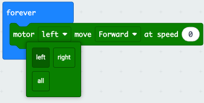
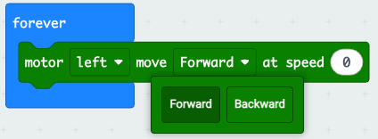
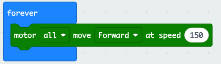

# Motorer

Micro Maqueen robotterne har forskellige egenskaber, men den vigtigste er klart motorerne. 

På robotten er der to motorer, der hver især kan styres. Blokken til motorerne findes under Maqueen v4:

Hvis vi ønsker vi ønsker at køre lige ud kan vi den tredje blok fra toppen. Først så vælger vi, at det skal være begge motorer.
 

Så vælger vi, at vi ønsker at køre fremad.

Og til sidst vælger vi hastighed.

## Vigtige ting at huske

Vi giver en liste af vigtige ting, der skal huskes.

1. Når man har bedt en motor om noget, så bliver den ved med at gøre det indtil den får en ny kommando. Det kan være en fordel at stoppe motorerne før en ny handling.
2. Man får robotten til at dreje ved at sætte forskellig hastighed på motorerne. Eller ved at sætte en motor til at bakke og en til at køre frem.
3. Den højeste hastighed er 255. Hvis robotten kører med 250, og der lægges 20 til hastigheden, så er den nye hastighed 15 og ikke 270. Dette kaldes wrap-around. Det samme sker, hvis hastigheden er 10, og der trækkes 30 fra, så er den nye hastighed 235. 