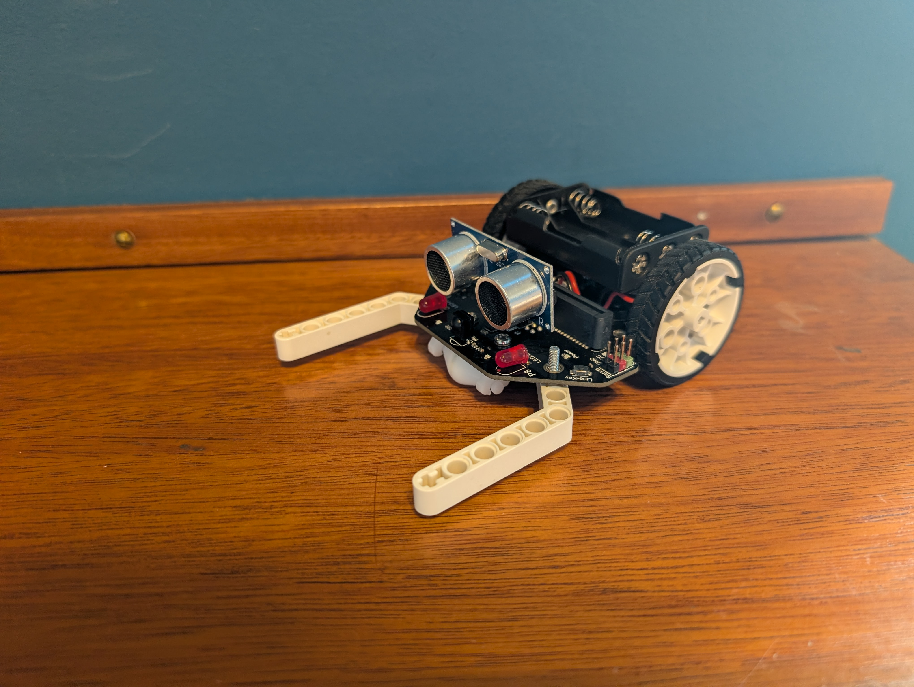

# Programmering af robotter

Dette afsnit handler om programmering af robotter. Nærmere bestemt micro maqueen robotter. Hvis man har nogle andre robotter kan der være noget, der går igen.

Micro maqueen robotterne styres af en micro bit og får strøm fra tre AAA-batterier. 

