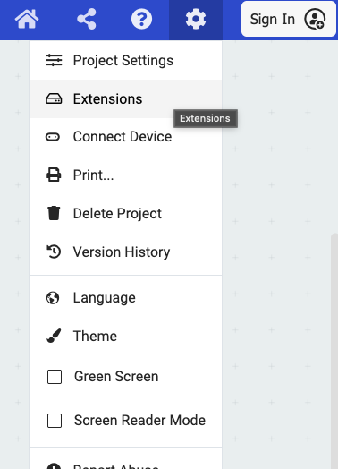
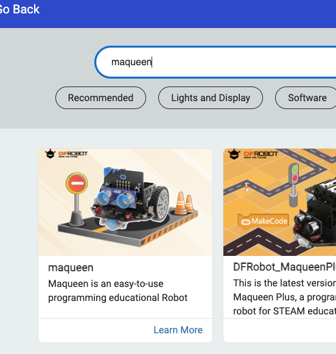
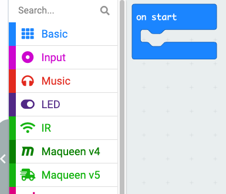

# Udvidelse til makecode

Før vi kan få en microbit til at styre en robot, skal vi installere en udvidelse der giver mulighed for at kommunikere med robotten. 

## Trin 1
I øverste højre hjørne er der et tandhjul. Hvis man klikker på det, kommer man til en menu, hvor man vælger extension/udvidelse. 

Klik på det.

## Trin 2

Der kommer et søgefelt frem. Søg på **maqueen**, og klik på det billede, der dukker neden for, hvor der står Maqueen

Det er billedet til venstre.

## Trin 3

Efter at have ventet lidt burde der dukke tre nye menupunkter op

Vi kommer til at anvende version 4.